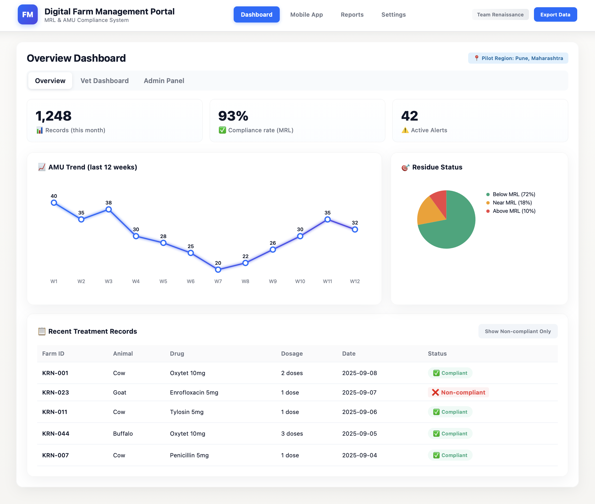

  <h1>Digital Farm Management Portal</h1>
  
<strong>Blockchain-Enabled Livestock Compliance & Real-time Monitoring</strong>

---

## Project Overview
The **Digital Farm Management Portal** is an end-to-end solution designed to modernize livestock management. It focuses on **AMU (Antimicrobial Usage)** and **MRL (Maximum Residue Limits)** compliance, ensuring that animal treatments are recorded transparently and securely to safeguard food chains.

### The Blockchain Advantage
To ensure data integrity and prevent "paper-trail" manipulation, this portal utilizes **Blockchain technology**. Every medical record, vaccination, and treatment log is immutable, providing a single source of truth for both farmers and veterinarians.

---

## Key Features
* **Real-time Compliance Tracking:** Instant monitoring of AMU/MRL levels via mobile and web interfaces.
* **Smart Alerts:** Automated notifications for withdrawal periods, vaccination schedules, and health anomalies.
* **Dual-Access Dashboards:** Tailored views for **Farmers** (field-level management) and **Veterinarians** (clinical oversight).
* **Cloud-Native Scalability:** Built on a scalable architecture to support high volumes of field data and multi-farm deployments.

---

## System Architecture
| Component | Technology |
| :--- | :--- |
| **Frontend** | React / Flutter (Mobile & Web Support) |
| **Backend** | Node.js / Flask (Scalable Microservices) |
| **Ledger** | Blockchain (Immutable Record Keeping) |
| **Database** | Secure Cloud Storage (SQL/NoSQL) |
| **Notifications** | Real-time Smart Alert System |

---

## Impact & Outcomes
* **Transparency:** Achieved 100% auditability for livestock medical history.
* **Efficiency:** Reduced manual record-keeping errors through field-level mobile data entry.
* **Compliance:** Improved adherence to safety standards, significantly reducing the risk of MRL violations in food products.

---

## System Preview

  

---

## Author
**Mandar Deshmukh** *Computer Science & Engineering* [LinkedIn](https://linkedin.com/in/your-profile)

---

  Advancing Agricultural Technology through Decentralization.

